# TFA Stellar Harmonics

**Universal Harmonic Structure in Stellar Oscillations: A Real-Number Coupling Framework**


## Scientific Integrity Notice

> This project uses human-AI collaboration. Some AI-generated claims were identified as confabulation and have been **retracted with full documentation**. See [docs/CONFABULATION_CORRECTIONS.md](docs/CONFABULATION_CORRECTIONS.md) for details. This demonstrates our commitment to scientific integrity over inflated claims.

## Overview

This repository contains the complete reproducibility package for the paper:

> **"Universal Harmonic Structure in Stellar Oscillations: A Real-Number Coupling Framework with Neutrino and Number-Theoretic Validation"**
>
> Jason A. King (2025)

**Systems Analyzed:** 25,857 stellar systems + gas giants (Jupiter, Saturn)

## Key Results

| Observable | Predicted | Measured | Match |
|------------|-----------|----------|-------|
| Neutrino D₂ | 1.46 ± 0.10 | 1.495 ± 0.144 | 96.9% |
| Super-K Δm² | 2.50 × 10⁻³ eV² | 2.43 × 10⁻³ eV² | 97.2% |
| Stellar 456-day clustering | Excess | 2.81× expected | p < 0.0001 |
| Jupiter Δν | 152 μHz | 155.3 μHz | 97.9% |
| Saturn p-modes | 608 μHz | ~600 μHz | ~99% |
| Murmuration node | 1/e = 0.3679 | 0.3627 | 98.6% |


## Repository Structure

```
TFA-Stellar-Harmonics/
├── paper/
│   └── stellar_paper.md              # Main paper
├── scripts/
│   ├── heartbeat_analysis.py         # Kirk 2016 catalog analysis
│   ├── analyze_heartbeat_stars.py    # OGLE/Kepler analysis
│   ├── analyze_triple_stars.py       # Triple system κ analysis
│   ├── analyze_tro_cycles.py         # TRO cycling zone analysis
│   ├── analyze_yu2018_red_giants.py  # 16,094 red giants analysis
│   ├── calculate_d2.py               # D₂ correlation dimension
│   ├── visualize_neutrino.py         # Neutrino visualization
│   └── analyze_10yr_d2.py            # IceCube 10-year D₂ analysis
├── docs/
│   ├── NEUTRINO_RESULTS.md           # IceCube D₂ validation (1.1M events)
│   ├── STELLAR_RESULTS.md            # Full 25,857 system results
│   ├── ZONE_CLASSIFICATIONS.md       # κ values by star type
│   ├── GAS_GIANTS.md                 # Jupiter/Saturn analysis
│   └── DATA_SOURCES.md               # All raw data links
├── data/
│   ├── 20211217_HESE-7-5-year-data.zip
│   └── 20080911_AMANDA_7_Year_Data.zip
├── results/
│   └── neutrino/                     # D₂ validation figures
├── RESULTS.md                        # Complete results record
├── requirements.txt
└── README.md
```

## The Framework

A single real-number equation governs coupled dynamical systems:

```
κ = R / (R + S)
```

Where:
- **S** = Structural constraint (mass, gravity, boundaries)
- **R** = Relational dynamics (energy, correlations, emergence)
- **κ*** = Critical threshold ≈ 1/e ≈ 0.368

**Derived Constants (zero free parameters):**
- κ* = 1/e ≈ 0.368 (critical coupling)
- D₂ = 19/13 ≈ 1.462 (correlation dimension)
- N₀ = 168e ≈ 456 (harmonic constant)


## Zone Classifications

| System Type | κ Value | Zone | Dynamical State |
|-------------|---------|------|-----------------|
| Gaia wide binaries | 0.281 ± 0.003 | Zone 1 | Structurally stable |
| Heartbeat stars | 0.167 ± 0.086 | Zone 1 | Structurally stable |
| Triple systems | 0.446 ± 0.143 | Zone 2 | Coupled developmental |
| KOI-54 | 0.57 | Zone 2 (upper) | Pre-transitional |

**Zone Definitions:**
- **Zone 1 (κ < 0.35):** Structurally stable — gravity/structure dominates, predictable evolution
- **Zone 2 (0.35 ≤ κ < 0.65):** Coupled developmental — balanced S-R coupling, sustainable change
- **Zone 3 (κ ≥ 0.65):** Pre-transitional — dynamics dominate, cycling behavior expected


See [docs/ZONE_CLASSIFICATIONS.md](docs/ZONE_CLASSIFICATIONS.md) for details.

## Thermal Relaxation Oscillations (TRO) — Independent Confirmation

The TFA zone structure predicts that systems crossing κ ≈ 0.65 should **cycle** rather than immediately collapse. This matches the well-documented phenomenon of **Thermal Relaxation Oscillations (TROs)** in binary star research:

> *"During the rapid thermal part of the mass transfer, the mass-transfer rate oscillates by up to three orders of magnitude... The donors recover as the mass-transfer rate decreases and the convective part of the outer layers regrows, restarting the cycle anew."*
> — [Schutte et al. 2024, A&A](https://www.aanda.org/articles/aa/full_html/2024/11/aa50354-24/aa50354-24.html)

**TFA Interpretation:** When κ crosses the 0.65 threshold:
1. Dynamics dominate → mass transfer accelerates
2. System overshoots → structure reasserts control
3. κ drops back below threshold → donor recovers
4. Cycle repeats until permanent transition or stabilization


This cycling behavior is observed in:
- Contact binaries (Lucy 1976, Robertson & Eggleton 1977)
- Dwarf novae (outburst cycles from days to decades)
- Mass-transferring systems at stability boundaries

**Key Sources:**
- [Exploring stable/unstable MT boundary (A&A 2024)](https://www.aanda.org/articles/aa/full_html/2024/11/aa50354-24/aa50354-24.html)
- [Contact Binary Stability (AAS 2024)](https://baas.aas.org/pub/2024n7i102p06/release/1)
- [Mass-ratio distribution of contact binaries (A&A 2023)](https://www.aanda.org/articles/aa/full_html/2023/04/aa45613-22/aa45613-22.html)
- [Dwarf novae outburst catalogue (MNRAS 2016)](https://academic.oup.com/mnras/article/456/4/4441/1033235)

## Gas Giant Validation

The 456/k pattern appears in gas giants **without fusion**:

| Planet | Measured | Predicted | Error |
|--------|----------|-----------|-------|
| Jupiter | 155.3 μHz | 456/3 = 152 μHz | 2.1% |
| Saturn | ~600 μHz | 456 × 4/3 = 608 μHz | ~1% |

**Conclusion:** The harmonic requires fluid dynamics, not nuclear burning.

See [docs/GAS_GIANTS.md](docs/GAS_GIANTS.md) for details.

## Data Sources

All data is publicly available for independent verification:

- **Kepler Heartbeat Stars**: [Kirk et al. 2016 (VizieR)](https://vizier.cds.unistra.fr/viz-bin/VizieR?-source=J/AJ/151/68)
- **Red Giants**: [Yu et al. 2018 (VizieR)](https://vizier.cds.unistra.fr/viz-bin/VizieR?-source=J/ApJS/236/42)
- **IceCube Neutrinos**: [HESE 7.5-year](https://icecube.wisc.edu/data-releases/)
- **Jupiter**: [Gaulme et al. 2011](https://doi.org/10.1051/0004-6361/201016290)
- **Saturn**: [Mankovich et al. 2019](https://doi.org/10.3847/1538-4357/aaf798)
- **Elliptic Curves**: [LMFDB Database](https://www.lmfdb.org/EllipticCurve/Q/)

See [docs/DATA_SOURCES.md](docs/DATA_SOURCES.md) for complete list.

## Data Pipeline

```mermaid
flowchart LR
    subgraph Data["Data Sources"]
        IC[IceCube HESE]
        KP[Kepler/OGLE]
        VZ[VizieR catalogs]
    end
    subgraph Scripts["Analysis Scripts"]
        S1[calculate_d2.py]
        S2[heartbeat_analysis.py]
        S3[analyze_triple_stars.py]
    end
    subgraph Output["Results"]
        R1["D₂ = 1.495"]
        R2[456d clustering]
        R3[κ distributions]
    end
    IC --> S1 --> R1
    KP --> S2 --> R2
    VZ --> S3 --> R3
```



## Requirements

```
numpy>=1.20.0
scipy>=1.7.0
matplotlib>=3.4.0
pandas>=1.3.0
scikit-learn>=0.24.0
astropy>=5.0.0
astroquery>=0.4.0
```

## Usage


```bash
# Analyze heartbeat stars (Kirk 2016 catalog)
python scripts/heartbeat_analysis.py

# Run full 25K analysis
python scripts/analyze_heartbeat_stars.py

# Calculate D₂ for neutrinos
python scripts/calculate_d2.py

# TRO cycling zone analysis
python scripts/analyze_tro_cycles.py

# Analyze triple star κ values
python scripts/analyze_triple_stars.py
```

## Falsification Criteria

The framework fails if:
1. D₂ measured outside 1.35-1.55 in independent datasets
2. 456-day stellar excess disappears in larger samples
3. Amplitude damping deviates >5% from prediction
4. Gas giant oscillations deviate >5% from 456/k
5. Murmuration nodes deviate >5% from 1/e

## Documentation

| Document | Contents |
|----------|----------|
| [GLOSSARY.md](docs/GLOSSARY.md) | **Definitions of all TFA terms and constants** |
| [NEUTRINO_RESULTS.md](docs/NEUTRINO_RESULTS.md) | **IceCube D₂ analysis (1.1M events, <1σ match)** |
| [STELLAR_RESULTS.md](docs/STELLAR_RESULTS.md) | Full Monte Carlo analysis of 25,857 systems |
| [ZONE_CLASSIFICATIONS.md](docs/ZONE_CLASSIFICATIONS.md) | κ values and zone structure for all star types |
| [GAS_GIANTS.md](docs/GAS_GIANTS.md) | Jupiter and Saturn oscillation analysis |
| [DATA_SOURCES.md](docs/DATA_SOURCES.md) | All raw data links for reproducibility |
| [CONFABULATION_CORRECTIONS.md](docs/CONFABULATION_CORRECTIONS.md) | **AI error corrections and retractions** |

## Citation

```bibtex
@article{king2025stellar,
  title={Universal Harmonic Structure in Stellar Oscillations:
         A Real-Number Coupling Framework},
  author={King, Jason A.},
  year={2025},
  note={GitHub: SchoolBusPhysicist/TFA-Stellar-Harmonics}
}
```

## License

This work is licensed under **[CC-BY-4.0](LICENSE)** (Creative Commons Attribution 4.0 International).

**You are free to:**
- Share and redistribute
- Adapt, remix, and build upon (including commercial use)

**With attribution:**
- Credit: Jason A. King
- Link to this repository
- Indicate if changes were made

See [LICENSE](LICENSE) for full terms.

## Contact

**Jason A. King**
Independent Researcher, Missouri, USA
GitHub: https://github.com/SchoolBusPhysicist/TFA-Stellar-Harmonics
